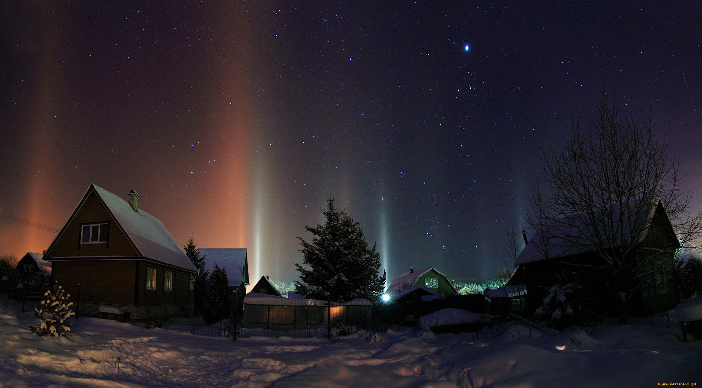

# Урок 10: Изображения (HTML Education)


Учебный проект по работе с изображениями в HTML. Практическая работа по изучению тегов для добавления и форматирования изображений на веб-странице.

---

## 🚀 Основные возможности

- **Тег ``**: Добавление изображений на веб-страницу.
- **Атрибуты изображений**: src, alt, width, height, title.
- **Относительные пути**: Использование локальных изображений.
- **Абсолютные пути**: Использование изображений по URL.
- **Форматирование текста**: Изучение различных тегов форматирования.

---

## 🛠 Технологический стек

- **HTML5**: Семантическая разметка страниц.
- **Изображения**: JPEG, PNG и другие форматы.

---

## 📋 Предварительные требования

- **Веб-браузер**: Современный браузер с поддержкой HTML5.
- **Текстовый редактор**: Notepad++, VS Code, Sublime Text или аналог.
- **ОС**: Любая платформа с веб-браузером.

---

## 🚀 Установка и запуск

### 1. Клонирование репозитория
```bash
git clone git@github.com:qazsedc13/html-education.git
cd html-education
```

### 2. Переключение на ветку
```bash
git checkout lesson-10/images
```

### 3. Открытие примеров
Откройте `example.html` в браузере.

---

## 📁 Структура проекта

| Файл | Описание |
| :--- | :--- |
| `example.html` | Основной пример с изображениями и текстом |
| `image.jpeg` | Пример локального изображения |
| `first.html` | Первый пример HTML |
| `Untitled-1.html` | Пустой шаблон |

---

## 💡 Работа с изображениями

### Добавление изображения
```html

```

### Изображение с описанием
```html

```

### Изображение с размерами
```html

```

### Изображение по URL
```html

```

---

## 📄 Лицензия

Проект распространяется под лицензией **MIT**.

---

## 📬 Контакты

- **Автор**: [qazsedc13](https://github.com/qazsedc13)
- **Репозиторий**: [html-education](https://github.com/qazsedc13/html-education)
- **Ветка**: `lesson-10/images`
